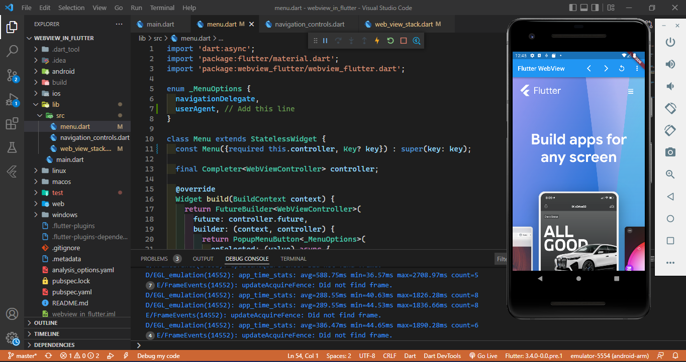

# webview_in_flutter

A new Flutter project.

# Praktikum webview

## Plugin yang Digunakan

* [webview_flutter](https://pub.dev/packages/webview_flutter)

## Hasil Tampilan Web View

* Pada langkah praktikum ini ditambahkan plugin WebView agar aplikasi dapat memuat halaman website.

## Hasil Load Progress Event

* Dengan adanya Load Progress Event, user experience akan lebih baik karena terdapat interaksi dari interface 
* Selama siklus pemuatan halaman WebView, ada tiga progress event dalam memuat halaman meliputi onPageStarted, onProgress, dan onPageFinished. 
* Pada praktikum ini, dilakukan penambahan progress bar yang akan menampilkan progress dari halaman yang dimuat.
* Membuat file lib/src/web_view_stack.dart untuk menampung widget WebView dan Progress Bar.

## Hasil Web Controller dan Navigasi

* Pada praktikum ini, dilakukan penambahan fungsi untuk mengontrol halaman dan navigasi.
* Membuat file /lib/src/navigation_controls.dart untuk menampung widget navigasi.
* Pengontrol tersedia dengan meanfaatkan callback yang diletakkan setelah konstruksi widget WebView. 
* Ketersediaan pengontrol ini bersifat asinkron dimana nilai kembaliannya bertipe Completer. Completer sejenis Future namun hasilnya bisa bernilai ataupun error.

## Menambahkan tombol menu ke AppBar

## Mengevaluasi JavaScript

## Hasil Mengelola Cookie

* Cookie adalah istilah untuk kumpulan informasi yang berisi rekam jejak dan aktivitas ketika menelusuri sebuah website. 
* Aplikasi Flutter dapat mengelola cookie di WebView dengan menggunakan fungsi pada class CookieManager. 
* Cookie dikelola dengan menampilkan daftar cookie, menghapus daftar cookie, menghapus cookie, dan menetapkan cookie baru pada tampilan menu. 

## 5. Hasil Membuat String HTML

* Menginstall path_provider
* Membuat folder assets/www, dan didalamnya ada index.html dan styles.css

